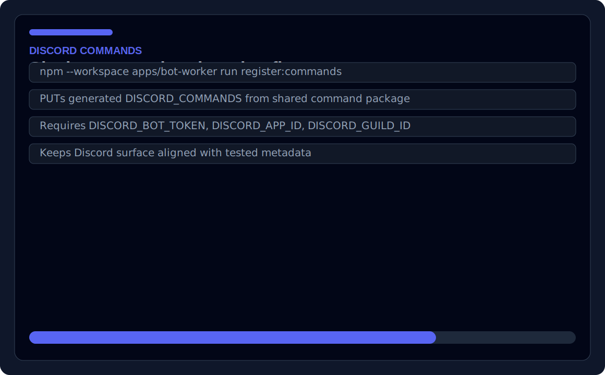
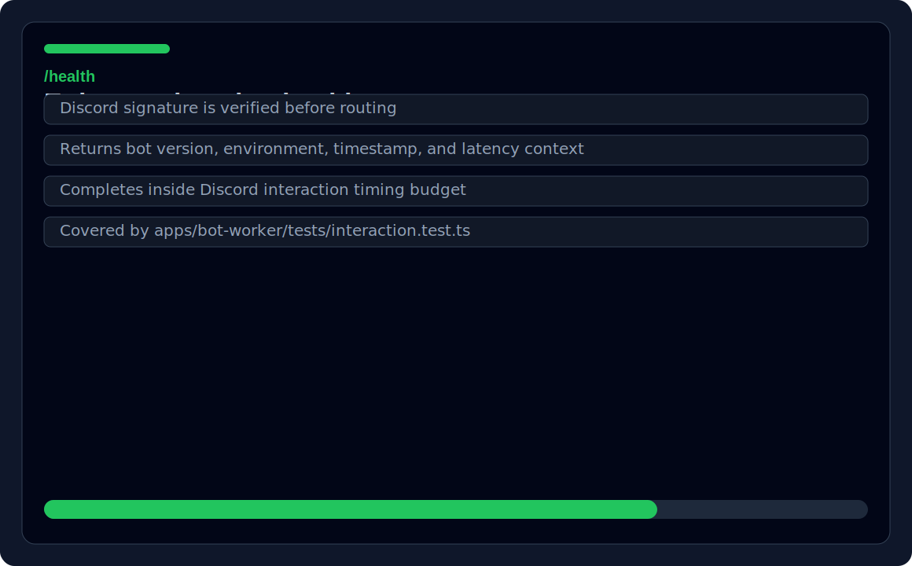
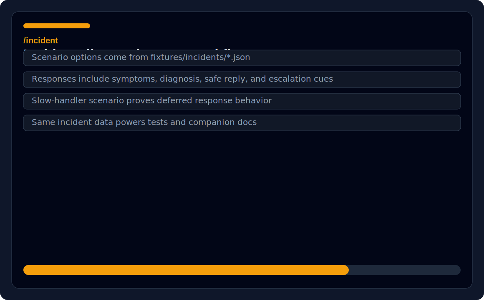
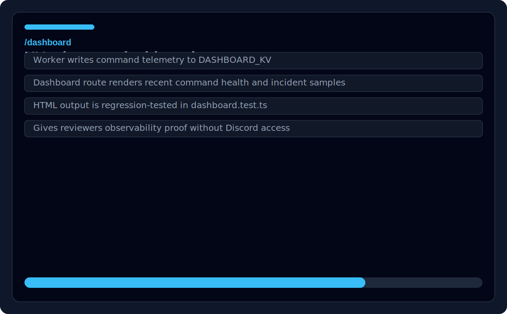
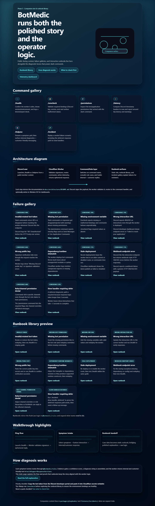
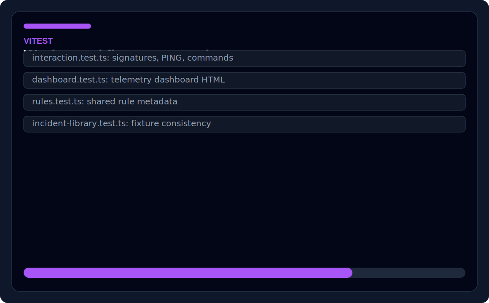

# BotMedic

BotMedic is a serverless Discord incident-triage platform built with TypeScript, Cloudflare Workers, Discord slash commands, Workers KV telemetry, shared command/rule packages, and a static companion docs site. It verifies Discord webhooks, routes support commands, records telemetry, publishes runbook content, and keeps incident fixtures aligned across worker tests and the public site. This project demonstrates webhook validation, API routing, serverless backend design, observability, shared TypeScript packages, incident fixtures, documentation UX, and Vitest regression coverage.

## Quick links
- **Live demo:** [companion docs site](https://josuejero.github.io/BotMedic/)
- **Metrics report:** [project metrics](https://josuejero.github.io/BotMedic/metrics.html)
- **Screenshots:** [command registration](site/assets/screenshots/command-registration.svg), [`/health`](site/assets/screenshots/health-command.svg), [`/incident`](site/assets/screenshots/incident-command.svg), [`/dashboard`](site/assets/screenshots/dashboard-command.svg), [companion site](site/assets/screenshots/companion-site.png), [test output](site/assets/screenshots/test-output.svg)
- **Test report:** `npm --workspace apps/bot-worker test`
- **CI workflow:** `.github/workflows/pages.yml`
- **Architecture docs:** `docs/architecture/README.md`, `docs/test-checklists/commands.md`, `site/README.md`
- **Main code to inspect:** `apps/bot-worker/`, `packages/commands/`, `packages/rules/`, `fixtures/incidents/`

## Project evidence
BotMedic includes 6 Discord slash commands, 10 diagnostic rule cases, 10 generated runbook pages, fixture-backed incident scenarios, Vitest regression tests, GitHub Pages deployment, and a generated metrics report. Exact test and coverage values are generated into `metrics/reports/METRICS.md` and the published metrics page.

| Evidence | Link |
|---|---|
| Live companion site | https://josuejero.github.io/BotMedic/ |
| Metrics report | https://josuejero.github.io/BotMedic/metrics.html |
| CI workflow | `.github/workflows/pages.yml` |
| Raw metrics schema | `metrics/current.json` |
| Test suites | `apps/bot-worker/tests/` |
| Coverage artifact | Generated by CI in `metrics/raw/coverage/` |

## Security and release hygiene
- OpenSSF Scorecard runs on `main` and publishes SARIF/code-scanning results.
- GitHub Actions use read-only top-level permissions and job-level write permissions only where needed.
- CodeQL scans TypeScript on pull requests, pushes to `main`, and a weekly schedule.
- Dependabot monitors npm and GitHub Actions dependencies.
- OSV Scanner checks dependency vulnerabilities on pull requests and weekly scheduled scans.
- CI generates CycloneDX and SPDX SBOM artifacts.
- `SECURITY.md` documents private vulnerability reporting and disclosure expectations.
- Branch rules and private vulnerability reporting must be enabled in GitHub repository settings after this branch is merged.

## Screenshot gallery
| Command registration | `/health` |
| --- | --- |
|  |  |

| `/incident` | `/dashboard` |
| --- | --- |
|  |  |

| Companion site | Test output |
| --- | --- |
|  |  |

## Architecture & mission
- BotMedic focuses on Discord signature validation, `/health`, telemetry capture, diagnostic commands, and surfacing the companion documentation site. The flow lives in `docs/architecture/README.md`: Discord sends interactions -> Cloudflare Worker verifies signatures and routes commands -> responses write to `DASHBOARD_KV` + `/dashboard` renders telemetry with incident samples.
- The companion site (`site/README.md`) mirrors the same command metadata/runbooks so the landing page, runbook list/detail pages, diagnosis overview, and quick-reference table stay in sync with the backend logic.

## Workspace layout
- `apps/bot-worker/`: Cloudflare Worker entry point, dashboards, telemetry helpers, full `/commands` handlers, Vitest suites, `wrangler.toml`, and the CLI script to register slash commands via `apps/bot-worker/scripts/register-commands.ts`. This directory is the deployment unit and references the shared packages for command metadata and rule cases.
- `packages/rules/`: shared rule catalog (`RULE_CASES`, builders, helpers) that seeds diagnostics, runbook content, and incident fixtures.
- `packages/commands/`: command catalog that exposes metadata, Discord command definitions, and ties into `@botmedic/rules` for runbook-aware options (e.g., `/incident` scenarios).
- `site/`: static HTML/CSS/JS companion narrative. `site/README.md` explains the landing page, runbook library, diagnosis overview, and quick reference, plus the shared CSS/JS assets that pull from the autogenerated `site/js/data.js` file.
- `fixtures/incidents/`: JSON fixtures (`symptoms.json`, `diagnosis-snapshots.json`, `customer-safe.json`, `dashboard-samples.json`) that back the diagnostics renderer, tests, and companion site narratives.
- `docs/`: architecture narratives and test checklists (see `docs/test-checklists/commands.md` for the command verification steps).
- `tests/`: workspace-level placeholder for cross-package tests; the real suites live under `apps/bot-worker/tests/`.

## Getting started
1. Install dependencies from the workspace root: `npm install` (relies on the workspace `apps/bot-worker` and shared packages). The worker also depends on `@noble/ed25519`, `undici`, and the shared command/rule packages via workspace references.
2. Configure Cloudflare through Wrangler login, CI secrets, or an uncommitted deployment config. The checked-in `apps/bot-worker/wrangler.toml` is intentionally buildable without account IDs or empty KV namespace placeholders. Provide secrets such as `DISCORD_PUBLIC_KEY`, `BOT_VERSION`, `BOT_ENV`, plus `DISCORD_BOT_TOKEN`, `DISCORD_APP_ID`, `DISCORD_GUILD_ID` for command registration.
3. Use the helper script to register commands: `npm --workspace apps/bot-worker run register:commands` (it loads `.env.local` via `dotenv` and PUTs `DISCORD_COMMANDS`).
4. Build and deploy: `npm --workspace apps/bot-worker run build` → `npm --workspace apps/bot-worker run deploy` (or `wrangler dev` for local testing). `/health` should return an ephemeral response with version, environment, and timestamp within 3 seconds.
5. Whenever the shared command/rule catalogs change, regenerate `site/js/data.js` via `npm run generate-site-data` (runs `scripts/generate-site-data.mts`) so the site, dashboards, and fixtures all align.

## Companion site & automation
- `site/js/data.js` is auto-generated from `@botmedic/commands` and `@botmedic/rules` by the `scripts/generate-site-data.mts` script; it’s consumed by `site/js/site.js` and the HTML runbook/landing pages to display the same metadata as the worker.
- Site assets are plain HTML/CSS/JS (`site/css/site.css`, `site/js/site.js`, `site/assets/`) so GitHub Pages or Cloudflare Pages can serve them directly.
- Continuous deployment is configured at `.github/workflows/pages.yml`: the build job installs dependencies, regenerates site data, runs `npm test`, and packages the `site/` folder; the deploy job publishes to GitHub Pages when `main` is updated.
- Fixtures (`fixtures/incidents/*.json`) drive the companion content, diagnostics, and the `apps/bot-worker/tests/incident-library.test.ts` suite. Update them alongside `RULE_CASES` to keep everything synchronized.

## Testing & regression guidance
- Local suite: `npm --workspace apps/bot-worker test` (Vitest) covers interaction routing, dashboard HTML, rule metadata, and incident fixtures (`apps/bot-worker/tests/interaction.test.ts`, `dashboard.test.ts`, `rules.test.ts`, `incident-library.test.ts`).
- Manual checklist: `docs/test-checklists/commands.md` spells out how to exercise `/health`, `/envcheck`, `/permissions`, `/latency`, `/helpme`, and `/incident`, plus regression expectations whenever new scenarios are added.
- After editing runbooks, rules, commands, or fixtures, re-run `npm run generate-site-data`, update `site/js/data.js`, refresh incident fixtures, and optionally re-run `npm --workspace apps/bot-worker test` before pushing.

## Incident runbooks & docs
- The worker exposes `/helpme` buttons (populated from `RULE_CASES`) and `/incident` scenarios (replaying `fixtures/incidents/*`). These same datasets feed the companion site’s runbook pages, the README architecture narrative, and the incident dashboard view (`/dashboard`).
- Keep `@botmedic/rules` and `fixtures/incidents` aligned: run `npm run generate-site-data` plus `npm --workspace apps/bot-worker test` after updating any symptom, evidence, diagnosis, or recovery step.
